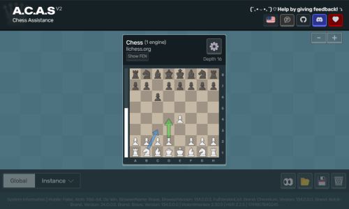
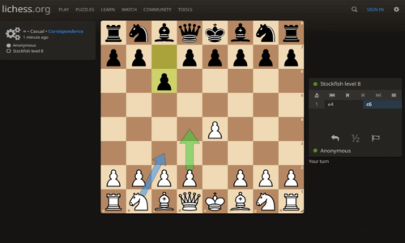

# Philosophy

This page discusses the fundemental idea behind A.C.A.S and how it works. A page for nerds like us, basically.

## Basics

What started as a fun technical challenge has turned into something much more useful. At first, we just wanted to see how far we could push a userscript, especially with cross-tab communication. But now, the focus has shifted—we’re building a real-time chess learning tool. Instead of only reviewing games after they’re done, you can get insights as you play, helping you improve in the moment. The goal is to make learning chess free, accessible, and open source, so anyone can get better.

## How It Works

Most userscripts mess with the site’s code or rely on its built-in functions, which makes them easy to detect and block. While it's understandable sites want to block such software, we believe real-time learning is extremely helpful and is not cheating if done correctly. So, we took a different route to bypass any restrictions. A.C.A.S reads the chess site to gather the data it needs but tries not to modify anything. It also doesn’t use any of the site’s own functions, keeping everything fully independent. And since it runs in a separate tab, it’s much harder to block, making it more stable and reliable over time.

!> The <a target="_about" href="../?shl=displayMovesOnExternalSite">Moves On External Site</a> setting adds a simple element to the site's document to display the move information. This modifies the site and is in risk of being detectable. While the element doesn't scream "**I WAS MADE BY A.C.A.S**", it could be detected either way.

## Reading The Board

The system first locates the chessboard element, which varies from site to site. Once identified, it scans within that element to detect individual pieces, utilizing multiple techniques to determine their type. Some platforms encode this information in class names, while others store it in attributes like `data-piece`. For more complex cases, A.C.A.S examines inline styles or even inspects pixel colors of the piece images. After classification, it assigns each piece its standard chess notation (FEN), differentiating between white and black pieces.

To establish piece positions, the system maps them to a coordinate grid. Some sites provide direct chess notation (e.g., `e2`), while others rely on pixel-based coordinates, transformations, or attribute-based indexing. When dealing with pixel positions, A.C.A.S converts them by computing their relative placement on the board. Once all pieces are mapped, the system compiles the data into a FEN string. Additionally, it monitors board orientation and move sequences, ensuring that captured pieces and new moves are accurately identified.

## Cross-Window Communication

#### First Tab (A.C.A.S GUI)


The engine runs on a completely different tab than the chess game page, completely isolated from it. This is done so that the site cannot block the usage of A.C.A.S. Since A.C.A.S is a userscript, it has certain restrictions and cannot operate in the same way as a proper browser extension. Well, why isn't A.C.A.S just a browser extension then? The challenge was fun, and still is, actually.

A.C.A.S sends move data via [CommLink](https://github.com/AugmentedWeb/CommLink) (which uses the userscript manager's storage as a kind of middle man). Now imagine some data transfering to the Lichess tab below,

*beep boop (っ＾▿＾)っ*

```
      0110010  
    0001100  
  1000110  

    0100110  
      000110  
    1000100  

```

*beep boop ╰(°▽°)╯*

#### Second Tab (Chess Site)


The userscript displays the data on the board using [UniversalBoardDrawer](https://github.com/Hakorr/UniversalBoardDrawer). (*If <a target="_about" href="../?shl=displayMovesOnExternalSite">Moves On External Site</a> is activated!*)